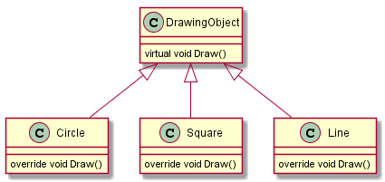
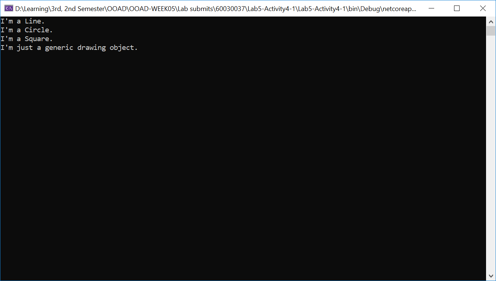
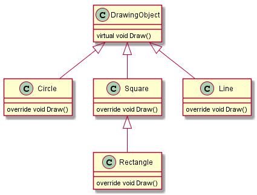
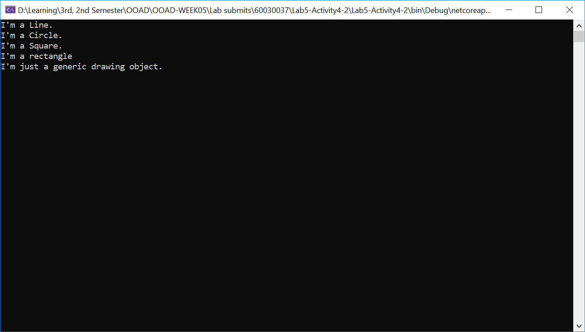
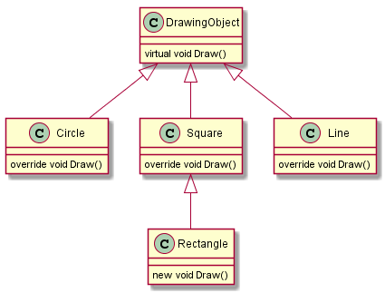
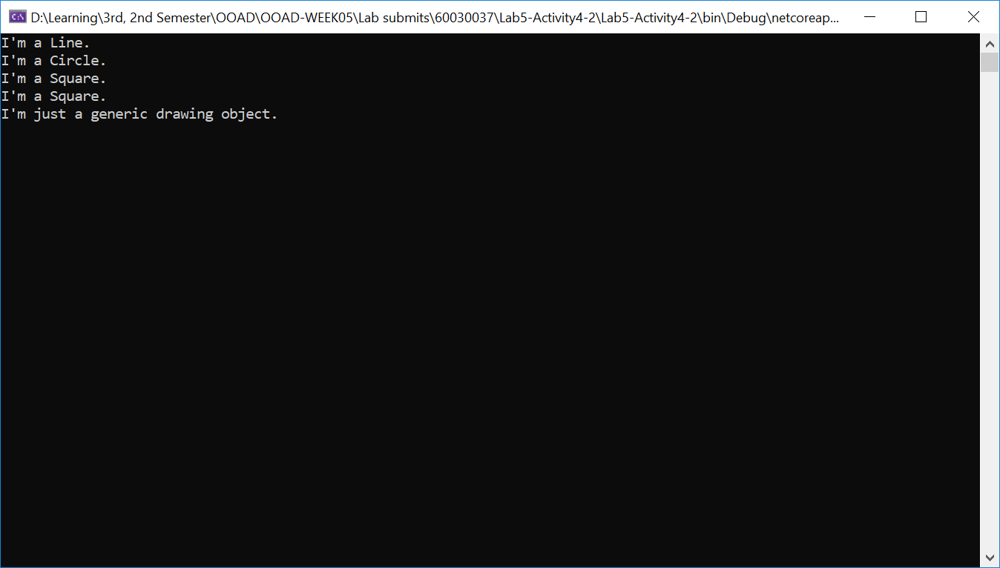

# Activity 4 Virtual-Override

## 1. Intro

แนวคิดหลักอีกประการหนึ่งของการเขียนโปรแกรมเชิงวัตถุคือ Polymorphism ซึ่งช่วยให้เราสามารถเรียกใช้เมธอดของ derived class ได้จาก reference ของ base class ในขณะ run-time

หลักการนี้มีประโยชน์มากเมื่อเราสร้างวัตถุที่มีลักษณะคล้ายๆ กันแล้วเก็บไว้ใน collection หรือ array แล้วเรียกใช้งานเมธอดของ derive class คราวละมากๆ  

ออปเจ็กต์ที่กล่าวมานั้นไม่จำเป็นต้องเป็นออปเจ็กต์จากคลาสเดียวกัน แต่ถ้าหากคลาสเหล่านั้นได้สืบทอดมาจาก base class ร่วมกัน เราก็สามารถสร้างเป็น array ของออปเจ็กชนิด base class และที่สำคัญคือถ้าเมธอดเหล่านั้นมีชื่อเดียวกัน (และ signature ตรงกัน) เราก็สามารถเรียกใช้ได้โดยง่าย  

ในการทดลองนี้ จะยกตัวอย่างการสืบทอดคุณสมบัติที่เห็นได้ชัด นั่นคือการวาดรูปทรงเรขาคณิต

## การทดลองย่อยที่ 1 เรื่อง polymorphism  

1.สร้าง console project ชื่อ `Lab5-Activiy4-1`  
คลาสไดอะแกรมสำหรับการทดลอง  




2.สร้าง base class ชื่อ `DrawingObject` โดยมีรายละเอียดดังนี้  

```C#
    public class DrawingObject
    {
        public virtual void Draw()
        {
            Console.WriteLine("I'm just a generic drawing object.");
        }
    }
```

เมธอด `Draw()` ในคลาส  `DrawingObject` มี modifier เป็น `virtual` หมายความว่าจะต้องมีเทธอดที่ชื่อเดียวกันนี้อยู่ในคลาสที่สืบทอดจาก  `DrawingObject` และมี modifier เป็น `override`

3.สร้าง class ชื่อ `Circle` ที่สืบทอดมาจาก `DrawingObject`

```C#
    public class Circle : DrawingObject
    {
        public override void Draw()
        {
            Console.WriteLine("I'm a Circle.");
        }
    }
```

4.สร้าง class ชื่อ `Line` ที่สืบทอดมาจาก `DrawingObject`

```C#
    public class Line : DrawingObject
    {
        public override void Draw()
        {
            Console.WriteLine("I'm a Line.");
        }
    }
```

5.สร้าง class ชื่อ `Square` ที่สืบทอดมาจาก `DrawingObject`

```C#
    public class Square : DrawingObject
    {
        public override void Draw()
        {
            Console.WriteLine("I'm a Square.");
        }
    }
```

6. แก้ไขเมธอด Main ให้เป็นดังต่อไปนี้

```C#
    public static int Main( )
    {

        // 1. สร้างอาร์เรย์ของออปเจกต์ของ base class มีพื้นที่เก็บ 4 ออปเจ็กต์ 
        DrawingObject[] dObj = new DrawingObject[4];


        // 1. สร้างออปเจกต์จาก derived class แต่ละตัวแล้วเก็บ reference ในอาร์เรย์ 
        dObj[0] = new Line();
        dObj[1] = new Circle();
        dObj[2] = new Square();
        dObj[3] = new DrawingObject();

        // วนลูปเพื่อเรียกเมธอดในแต่ละออปเจ็กต์
        foreach (DrawingObject drawObj in dObj)
        {
            drawObj.Draw();
        }

        return 0;
    }
```

7.รันโปรแกรมและบันทึกผล  
7.1 อธิบายการทำงานของโปรแกรม  

```
    เป็นการสร้าง array of DrawingObject ซึ่งเป็น base class ของ class อื่น ๆ แล้วทำการประกาศให้ array แต่ละตำแหน่งเป็น ref ของ Inherited Object แต่ละประเภทอันได้แก่ Line Circle Square และ DrawingObject จากนั้นจึงทำการวนลูป array นั้น ให้เรียกใช้ method Draw ของแต่ละ Object ซึ่งใน base Class ได้กำหนด method Draw ไว้เป็น virtual ในส่วนของ inherited Class ได้กำหนด method Draw ไว้เป็น override ดังนั้น หากเรียกใช้ method Draw แล้ว หากเป็นการเรียกจากคลาสลูกก็จะเรียก method Draw ของคลาสลูกแต่ละตัว โดยไม่สนใจ method Draw ของ parent ซึ่งเป็น virtual และหากเรียกใช้ method Draw ของ parent ก็จะทำการเรียกใช้งาน method Draw ของ parent (virtual) เอง 
```

---

## การทดลองย่อยที่ 2 เรื่อง การสืบทอดหลายชั้น  


จากการทดลองที่ผ่านมาจะเป็นการสืบทอดคลาสเพียง 1 ชั้น และจากความเป็นจริงเราพบว่า สี่เหลี่ยมจัตุรัส `Square` นั้นจะมีคุณสมบัติคล้ายกับที่เหลี่ยมผืนผ้า `Rectangle` โดยสิ่งที่ต่างกันก็คือสี่เหลี่ยมจัตุรัสจะมีด้านทั้งสี่เท่ากัน แต่สี่เหลี่ยมผืนผ้าจะมีด้านสองคู่เท่ากัน
การออกแบบแผนผังของคลาส จึงสามารถนำคลาส `Square` มา reuse โดยเพิ่มด้านเข้าไปอีก 1 ด้าน โดยคลาส `Rectangle` จะ reuse ทุกอย่างใน `Square`

1.สร้าง console project ชื่อ `Lab5-Activiy4-2`  

คลาสไดอะแกรมสำหรับการทดลอง  

 

2.เพิ่มคลาส `Rectangle` โดยให้สืบทอดจากคลาส  `Square`

```C#
    public class Rectangle : Square
    {
        public override void Draw()
        {
            Console.WriteLine("I'm a rectangle.");
        }
    }
```

3. แก้ไขเมธอด Main ให้เป็นดังต่อไปนี้

```C#
    public static int Main( )
    {

        // 1. สร้างอาร์เรย์ของออปเจกต์ของ base class มีพื้นที่เก็บ 5 ออปเจ็กต์ 
        DrawingObject[] dObj = new DrawingObject[5];


        // 1. สร้างออปเจกต์จาก derived class แต่ละตัวแล้วเก็บ reference ในอาร์เรย์ 
        dObj[0] = new Line();
        dObj[1] = new Circle();
        dObj[2] = new Square();
        dObj[3] = new Rectangle();
        dObj[4] = new DrawingObject();

        // วนลูปเพื่อเรียกเมธอดในแต่ละออปเจ็กต์
        foreach (DrawingObject drawObj in dObj)
        {
            drawObj.Draw();
        }

        return 0;
    }
```

4.รันโปรแกรมและบันทึกผล  
4.1 อธิบายการทำงานของโปรแกรม  

```
    เป็นการสร้าง array of DrawingObject ซึ่งเป็น base class ของ class อื่น ๆ แล้วทำการประกาศให้ array แต่ละตำแหน่งเป็น ref ของ Inherited Object แต่ละประเภทอันได้แก่ Line Circle Square Rectangle(Inherited from Square) และ DrawingObject จากนั้นจึงทำการวนลูป array นั้น ให้เรียกใช้ method Draw ของแต่ละ Object ซึ่งใน base Class ได้กำหนด method Draw ไว้เป็น virtual ในส่วนของ inherited Class ได้กำหนด method Draw ไว้เป็น override ดังนั้น หากเรียกใช้ method Draw แล้ว หากเป็นการเรียกจากคลาสลูกก็จะเรียก method Draw ของคลาสลูกแต่ละตัว โดยไม่สนใจ method Draw ของ parent ซึ่งเป็น virtual และหากเรียกใช้ method Draw ของ parent ก็จะทำการเรียกใช้งาน method Draw ของ parent (virtual) เอง 
```


## การทดลองย่อยที่ 3 เรื่อง การใช้คีย์เวิร์ด new กับเส้นทางการสืบทอด

 


1.แก้โค้ดในคลาส `Rectangle` ให้เป็นดังนี้

```C#
    public class Rectangle: Square
    {
        public new void Draw()
        {
            Console.WriteLine("I'm a rectangle.");
        }
    }
```

2.รันโปรแกรมและบันทึกผล  
2.1 อธิบายการทำงานของโปรแกรม  

```
    เป็นการสร้าง array of DrawingObject ซึ่งเป็น base class ของ class อื่น ๆ แล้วทำการประกาศให้ array แต่ละตำแหน่งเป็น ref ของ Inherited Object แต่ละประเภทอันได้แก่ Line Circle Square Rectangle(Inherited from Square) และ DrawingObject จากนั้นจึงทำการวนลูป array นั้น ให้เรียกใช้ method Draw ของแต่ละ Object ซึ่งใน base Class ได้กำหนด method Draw ไว้เป็น virtual ในส่วนของ inherited Class ได้กำหนด method Draw ไว้เป็น override ดังนั้น หากเรียกใช้ method Draw แล้ว หากเป็นการเรียกจากคลาสลูกก็จะเรียก method Draw ของคลาสลูกแต่ละตัว โดยไม่สนใจ method Draw ของ parent ซึ่งเป็น virtual และหากเรียกใช้ method Draw ของ parent ก็จะทำการเรียกใช้งาน method Draw ของ parent (virtual) เอง และเนื่องจาก method Draw ของ Rectangle เป็นแบบ new ซึ่งถือว่าอยู่นอกเหนือกฎของการ inheritance จึงไม่ถูกเรียกใช้ เนื่องจาก dObj ของ Rectangle ถือกำเนิดขึ้นมาจาก DrawingObject และจะเรียกใช้ method override ของ class ลูกเท่านั้น ในหน้าต่าง console จึงปรากฎข้อความของ parent class of Rectangle จึงปรากฎข้อความ I'm a Square ขึ้นมาแทนซึ่งเป็น method Draw ของ parent class
```
