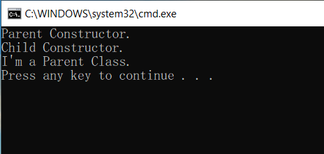
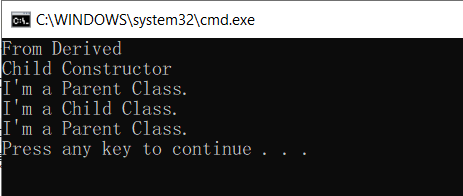

# Activity 3 Base Access

การสืบทอดคลาส เป็นหนึ่งในแนวคิดหลักของการเขียนโปรแกรมเชิงวัตถุซึ่งช่วยให้เราสามารถนำ code ที่มีอยู่กลับมาใช้ใหม่ได้ด้วยการใช้งานซ้ำอย่างมีประสิทธิภาพ สามารถประหยัดเวลาในการเขียนโปรแกรมและลดโอกาสที่จะเกิดความผิดพลากจากการ copy - paste และช่วยให้คลาสใหม่ได้รับ feature ที่เพิ่มชึ้นจาก base class โดยอัตโนมัติ

อย่างไรก็ตาม ในบางครั้งที่คลาสที่รับการสืบทอด มีความต้องการที่จะเข้าถึงเมธอดของ base class โดยครง ภาษา C# ก็มีวิธีการให้เราทำเช่นนั้นได้เช่นกัน

## การทดลองย่อยที่ 1

1.1 สร้าง project ใหม่เป็นแบบ console application ชื่อ `Lab5-Activity3-1`  
1.2 สร้าง base class โดยให้ชื่อว่า `ParentClass`  ไว้ด้านใต้ `class Program` และมีรายละเอียดดังนี้

```C#
    public class ParentClass
    {
        public ParentClass()
        {
            Console.WriteLine("Parent Constructor.");
        }

        public void print()
        {
            Console.WriteLine("I'm a Parent Class.");
        }
    }
```

1.3 สร้าง derived class ถัดจาก `ParentClass` โดยให้ชื่อว่า `ChildClass` และมีการสืบทอดจาก `ParentClass`

```C#
public class ChildClass : ParentClass
{
    public ChildClass()
    {
        Console.WriteLine("Child Constructor.");
    }
}
```

1.4 แก้ไขเมธอด `Main()` ในคลาส `Program` ให้เป็นดังนี้

```C#
    static void Main(string[] args)
    {
        ChildClass child = new ChildClass();

        child.print();
    }
```

1.5 รันโปรแกรม บันทึกผลดังต่อไปนี้  
1.5.1 บันทึกภาพหน้าจอของโปรแกรมที่รันได้  



1.5.2 อธิบายลำดับการทำงานของโปรแกรม ว่าโปรแกรมทำงานอย่างไร ในการสร้างออปเจ็กต์ของ ChildClass นั้น คลาสใดถูกเรียกก่อน (สังเกตุจากลำดับการทำงานของ constructor)  

เรียกใช้ฟังก์ชั่น child.print() ซึ่งคลาส ParentClass จะถูกเรียกออกมาก่อนและตามด้วย Childcalss 

1.5.3 ความสามารถ (เมธอด) อะไรบ้างที่ ChildClass ได้รับสืบทอดมาจาก ParentClass โดยที่ไม่ค้องเขียน code เอง

เมธอด void print()

## การทดลองย่อยที่ 2

2.1 สร้าง project ใหม่เป็นแบบ console application ชื่อ `Lab5-Activity3-2`  
2.2 สร้าง base class  ชื่อ `Parent`

```C#
    public class Parent
    {
        string parentString;
        public Parent()
        {
            Console.WriteLine("Parent Constructor.");
        }

        public Parent(string myString)
        {
            parentString = myString;
            Console.WriteLine(parentString);
        }

        public void print()
        {
            Console.WriteLine("I'm a Parent Class.");
        }
    }
```

คลาส Parent มีการเพิ่ม Constructor  ขึ้นมาอีก 1 ตัว มี signature เป็น  

```C#
    public Parent(string myString)
```

โดยมีจุดมุ่งหมายให้ Child ซึ่งเป็น derived class ได้เรียกใช้ในช่วงสร้าง object  เมื่อ constructor ตัวนี้ถูกเรียก จะทำให้ default constructor ของ Parent ไม่ถูกใช้งานไปโดยอัตโนมัตอ เนื่องจาก constructor จะถูกเลือกจากรูปแบบของเมธอดที่ใช้เรียก base class นั่นเอง

2.3 สร้าง derived class  ชื่อ `Child` ซึ่งสืบทอดจาก `Parent`  

```C#
    public class Child : Parent
    {
        public Child() : base("From Derived")
        {
            Console.WriteLine("Child Constructor.");
        }

        public new void print()
        {
            base.print();
            Console.WriteLine("I'm a Child Class.");
        }
    }
```

constructor ของ `Child` ซึ่งเป็น derived class ถูกสร้างโดยมีการส่งข้อความให้ base class  

```C#
    ...
    public Child() : base("From Derived")
    ...
```

ซึ่งจะส่งผลให้ constructor ของ base class ที่ถูกเรียกจะต้องเป็น constructor ที่รับพารามิเตอร์เป็น string  จำนวน 1 ตัว นั่นก็คือ `public Parent(string myString)` และทำให้ default constructor ไม่ถูกเรียกใช้งาน

ในเมธอด `public new void print()` นั้น จะเห็นว่ามีการเรียกใช้ `base.print();` ที่ทำให้ `Child` สามารถเรียกใช้เมธอด `print()` ของ `Parent` ได้

2.3 แก้ไขเมธอด `Main`

```C#
    public static void Main()
    {
        Child child = new Child();
        child.print();
        ((Parent)child).print();
    }
```

2.4 รันโปรแกรม บันทึกผลดังต่อไปนี้  

2.4.1 บันทึกภาพหน้าจอของโปรแกรมที่รันได้  



2.4.2 อธิบายการทำงานของโปรแกรม  

    สร้างออปเจ็ค child ของคลาส Child ระหว่างสร้างออปเจ็ค default constructor ของ Parent จะไม่ถูกใช้งาน 
แต่ default constructor ของ Child ซึ่งเป็น derived class มีการส่งข้อความให้กับ base class และจากการ
ใช้ base.print() ในคลาส Child ทำให้สามารถเรียกใช้ .print() ของคลาส Parent ได้ 
    ระหว่างสร้างออปเจ็คคลาส Child ตัว constructor รับพารามิเตอร์มาเป็นสตริงเพื่อแสดงผลเป็นอันดับแรก เมื่อเรียกใช้ 
child.print() จะไปดึงฟังก์ชั่น print() ในคลาส child มาแสดงผลและจากนั้นจะไปเรียกฟังก์่น print จากคลาส Parent มาแสดงผลต่อ ในคำสั่งบรรทัด ((Parent)child).print(); เป็นการเรียกฟังก์ชั่น print ของคลาส child ที่สืบทอดจากคลาส Parent มาแสดงผลเป็นลำดับสุดท้าย
